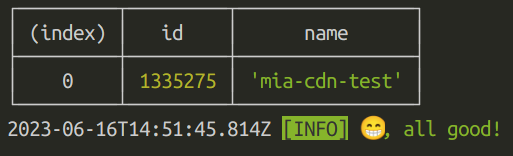
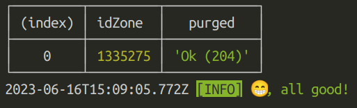

# CDN publish

_CDN publish_ is a Node.js bin CLI to manage files on Mia's instance of the [bunny.net](https://bunny.net) global CDN
storage service.

An instance of a bunny CDN provides a [file storage API](https://docs.bunny.net/reference/storage-api)
that is scoped for your organization by a `storageZoneName` which is usually provided to you via secret
sharing tools like vault.

Such `storageZoneName` combined with an access key gives full access to file operations like

- downloads
- put/patch
- delete

Beside providing a helpful (we hope!) wrapper around the basic HTTP client needed to query the API, _CDN publish_
provides opinionated behaviors that make the put/patch API look like `npm publish` and `yarn npm publish`

## `npm`-like behaviors

When we reference `npm publish` we also refer to the `yarn` wrapper for `yarn 2+` which is an opinionated wrapper
of `npm publish` which does not change the behaviors and functionality discussed here

1. `npm publish` will use the `package.json` file available in the working directory to establish:
   1. which files to push -> [`files` key](https://docs.npmjs.com/cli/v9/configuring-npm/package-json#files)
   2. the scope of your package by using the [`name` key](https://docs.npmjs.com/cli/v9/configuring-npm/package-json#name) first slice before a `/` which most often starts with an `@` sign.
2. `npmjs` registry does not allow to PUT twice the same [`semver` version](https://semver.org/spec/v2.0.0.html) of a package, like `0.1.0` or `3.0.10-rc2`. Although we cannot enforce it on the file storage API, _CDN publish_ enforces it (with possibility to override) on the client side. This is useful to avoid incorrect CI runs.

## How to use it

_CDN publish_ is focused on `npm` packages publish.

_CDN publish_ has **always** two required parameter:

- `-s` or `--storage-zone-name` which is the `storageZoneName` you're targetting;
- `-k` or `--storage-access-key` which is the API key of the `storageZoneName` you're targetting.

Typically a release/deploy pipeline will take care or install node, build your library and caching the build
results which must be available to the cdn release job/step.

### As a CLI for file storage

_CDN publish_ can be invoked as a standalone binary from `npm`
by installing on your global npm bin store

```shell
npm install -g ??/mystery-box
```

and then

```shell
cdn [options] [command]
```

### GitLab job

In a GitLab CI, the _CDN publish_ CLI can be called by running its container as per the following snippet

```yaml
cdn-release:
  stage: release
  image: miaplatform/cdn-publish
  needs:
    []
    # 👆 your dependencies
  rules:
    []
    # 👆 your rules
  cache:
    []
    # 👆 your cache
  script:
    - cdn publish -k "$STORAGE_ACCESS_KEY" -s "$STORAGE-ZONE"
```

### From source code

This repository can be used as well to run _CDN publish_

```shell
git clone https://github.com/mia-platform/cdn-publish.git
```

then install (we recommend using nvm to ensure proper Node.js versioning)

```shell
npm i
# or
yarn install
```

then you can either run Typescript code

```shell
npm run cli:run [options] [command]
# or
yarn cli:run [options] [command]
```

or build and test the final bundled binary

```shell
npm run build
# or
yarn build

# and then
node dist/index.cjs [options] [command]
```

## Commands and Syntax

Here's a list of available commands that _CDN publish_ provides. The
placeholder `cdn` stands for the command invocation, which could either be:

1. [npm] `npx --package "@mia-platform/cdn-publish" cdn`
2. [yarn] `yarn dlx --package "@mia-platform/cdn-publish" cdn`
3. [docker container] `cdn`
4. [local bundle] `node dist/index.cjs`
5. [local install] `npm i -g . && cdn`

### Help

Provides information on commands and options

```shell
cdn help [command]
```


### List

Provides a list of the file currently available on the storage service under
a given path/directory

```shell
cdn list [options] <dir>
```

with options:

- `-k`, `--storage-access-key` -- **required**, the `storageZoneName` access key
- `-s`, `--storage-zone-name` -- **required**, the `storageZoneName`
- `-u`, `--base-url` -- the api base url, default is: `https://storage.bunnycdn.com`


### Publish

Allows to put/patch files onto the CDN file storage service

```shell
cdn publish [options] [files...]
```

the `files` optional argument takes precedence over anything specified in the `package.json`
file selected (or defaulted) by the invocation of _CDN publish_

with options:

- `-k`, `--storage-access-key` -- **required**, the `storageZoneName` access key
- `-s`, `--storage-zone-name` -- **required**, the `storageZoneName`
- `-u`, `--base-url` -- the api base url, default is: `https://storage.bunnycdn.com`
- `-p`, `--project` -- used to override the location of the `package.json` file. Useful for repositories with workspaces
- `-s`, `--scope` -- a directory to prepend to all pushed files. Defaults to the `package.json`'s `name` field matched against `/^@([^/]+)\//`
- `--override-version [string]` -- in case the pushed context is sem-versioned, allows to opt-out of the client no-double-push policy on semver packages.
- `--checksum` -- requires the [server](https://docs.bunny.net/reference/put_-storagezonename-path-filename) to fail the push if uploaded file has a checksum that does not match with the one computed on the client side.


### Delete

Provides cleanup/delete of a directory or a file on the file storage service

```shell
cdn delete [options] <dir>
```

with options:

- `-k`, `---access-key` -- **required**, the `storageZoneName` access key
- `-s`, `--storage-zone-name` -- **required**, the `storageZoneName`
- `-u`, `--base-url` -- the api base url, default is: `https://storage.bunnycdn.com`
- `--avoid-throwing` -- in case of error it avoids returning an `exit 1`. Useful for CI/CD environments.


## Commands to manage pull zones

Here is a list of commands used to be able to interact with pull zones:

**Caution: The '--access-key' token should not be confused with the '--storage-access-key' token, which is used only for file management purposes.**

### List

Provides a list of the avaiable pullzones

```shell
cdn pullzone list [options]
```

with options:

- `-k`, `--access-key` -- **required**, the `storageZoneName` access key
- `-u`, `--base-url` -- the api base url, default is: `https://api.bunny.net`
- `-s`, `--search` -- a query param to filter results (**NB. Broken in bunny API!**)



### Purge

The following command is used to purge pull zones, either individually selected or all of them by default. Upon execution, the command provides information about the zone ID and the corresponding API response status, to know the successfully purged zones.

```shell
cdn pullzone purge [options]
```

with options:

- `-k`, `--access-key` -- **required**, the `storageZoneName` access key
- `-u`, `--base-url` -- the api base url, default is: `https://api.bunny.net`
- `-z`, `--zone` -- to purge only a specific zone id


