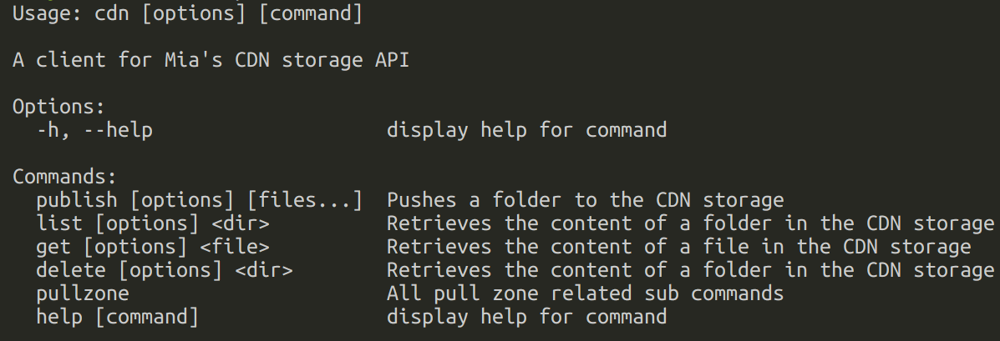
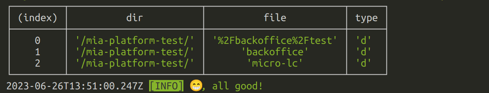
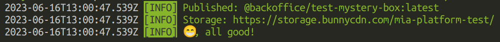
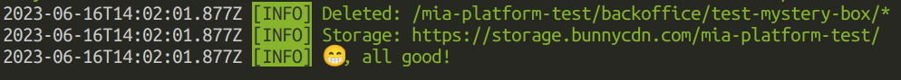

# mystery box

_Mystery Box_ is a Node.js bin CLI to manage files on Mia's instance of the [bunny.net](https://bunny.net) global CDN
storage service.

An instance of a bunny CDN provides a [file storage API](https://docs.bunny.net/reference/storage-api)
that is scoped for your organization by a `storageZoneName` which is usually provided to you via secret
sharing tools like vault.

Such `storageZoneName` combined with an access key gives full access to file operations like

- downloads
- put/patch
- delete

Beside providing a helpful (we hope!) wrapper around the basic HTTP client needed to query the API, _Mystery Box_
provides opinionated behaviors that make the put/patch API look like `npm publish` and `yarn npm publish`

## `npm`-like behaviors

When we reference `npm publish` we also refer to the `yarn` wrapper for `yarn 2+` which is an opinionated wrapper
of `npm publish` which does not change the behaviors and functionality discussed here

1. `npm publish` will use the `package.json` file available in the working directory to establish:
   1. which files to push -> [`files` key](https://docs.npmjs.com/cli/v9/configuring-npm/package-json#files)
   2. the scope of your package by using the [`name` key](https://docs.npmjs.com/cli/v9/configuring-npm/package-json#name) first slice before a `/` which most often starts with an `@` sign.
2. `npmjs` registry does not allow to PUT twice the same [`semver` version](https://semver.org/spec/v2.0.0.html) of a package, like `0.1.0` or `3.0.10-rc2`. Although we cannot enforce it on the file storage API, _Mystery Box_ enforces it (with possibility to override) on the client side. This is useful to avoid incorrect CI runs.

## How to use it

_Mystery Box_ is focused on `npm` packages publish.

_Mystery Box_ has only one **always** required parameter, `-k` or `--access-key` which is the API key of
the `storageZoneName` you're targetting.

Typically a release/deploy pipeline will take care or install node, build your library and caching the build
results which must be available to the cdn release job/step.

### As a CLI

==============> **TODO**

_Mystery Box_ can be invoked as a standalone binary from `npm`
by installing on your global npm bin store

```shell
npm install -g ??/mystery-box
```

and then

```shell
mb [options] [command]
```

### GitLab job

In a GitLab CI, the _Mystery Box_ CLI can be called by running its container as per the following snippet

```yaml
cdn-release:
  stage: release
  image: nexus.mia-platform.eu/back-kit/mystery-box:0.1.0
  needs: []
    # 👆 your dependencies
  rules: []
    # 👆 your rules
  cache: []
    # 👆 your cache
  script:
    - mb publish -k "$STORAGE_ACCESS_KEY"
```

### From source code

This repository can be used as well to run _Mystery Box_

```shell
git clone https://git.tools.mia-platform.eu/platform/backoffice/back-kit/mystery-box.git
```

then install (we recommend using nvm to ensure proper Node.js versioning)

```shell
npm i
# or
yarn install
```

then you can either run Typescript code

```shell
npm run cli:run [options] [command]
# or
yarn cli:run [options] [command]
```

or build and test the final bundled binary

```shell
npm run build
# or
yarn build

# and then
node dist/index.cjs [options] [command]
```

## Commands and Syntax

Here's a list of available commands that _Mystery Box_ provides. The
placeholder `mb` stands for the command invocation, which could either be:

1. [npm] `npx ??/mystery-box`
2. [yarn] `yarn dlx ??/mystery-box`
3. [docker container] `mb`
4. [local bundle] `node dist/index.cjs`

### Help

Provides information on commands and options

```shell
mb help [command]
```



### List

Provides a list of the file currently available on the storage service under
a given path/directory

```shell
mb list [options] <dir>
```

with options:

- `-k`, `--access-key` -- **required**, the `storageZoneName` access key



### Publish

Allows to put/patch files onto the CDN file storage service

```shell
mb publish [options] [files...]
```

the `files` optional argument takes precedence over anything specified in the `package.json`
file selected (or defaulted) by the invocation of _Mystery Box_

with options:

- `-k`, `--access-key` -- **required**, the `storageZoneName` access key
- `-p`, `--project` -- used to override the location of the `package.json` file. Useful for repositories with workspaces
- `-s`, `--scope` -- a directory to prepend to all pushed files. Defaults to the `package.json`'s `name` field matched against `/^@([^/]+)\//`
- `--override-version [string]` -- in case the pushed context is sem-versioned, allows to opt-out of the client no-double-push policy on semver packages.
- `--checksum` -- requires the [server](https://docs.bunny.net/reference/put_-storagezonename-path-filename) to fail the push if uploaded file has a checksum that does not match with the one computed on the client side.



### Delete

Provides cleanup/delete of a directory or a file on the file storage service

```shell
mb delete [options] <dir>
```

with options:

- `-k`, `--access-key` -- **required**, the `storageZoneName` access key
- `--avoid-throwing` -- in case of error it avoids returning an `exit 1`. Useful for CI/CD environments.


